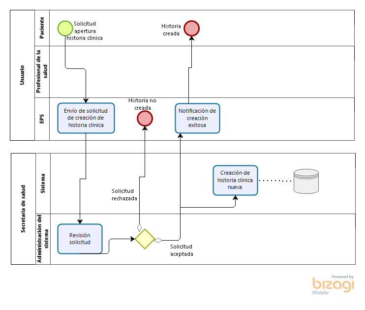
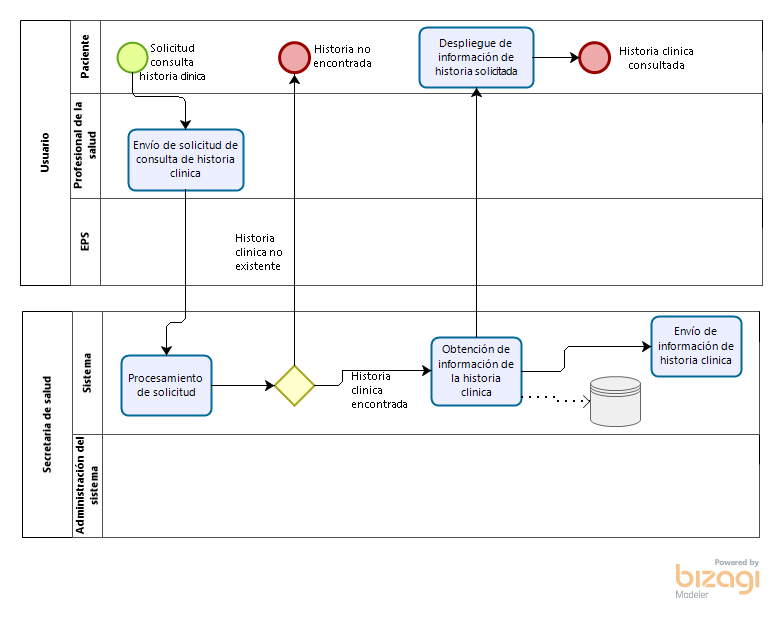

## Detalles de la empresa:

**Nombre:** Alpha-Omega Software

**Sector:** Terciario. Empresa prestadora de servicios.

**Misión:** _Alpha-Omega Software_ tiene como objetivo brindar soluciones a problemas planteados por los clientes, a partir de la planeación, diseño, desarrollo y mantenimiento de software especializado que se adecue a las necesidades y condiciones de cada escenario.

**Visión:** Para 2021, **Alpha-Omega Software** será una empresa bien posicionada en la industria del desarrollo de software a nivel nacional, experta en tecnologías de vanguardia y en la implementación de políticas de TIC del gobierno nacional.

## Equipo de Trabajo:

<table>
  <tr>
   <td><strong>Nombre</strong>
   </td>
   <td><strong>Rol</strong>
   </td>
   <td><strong>Grupo de trabajo</strong>
   </td>
  </tr>
  <tr>
   <td>Julián David Rodríguez Ruíz
   </td>
   <td>Product owner
   </td>
   <td>Front-end
   </td>
  </tr>
  <tr>
   <td>Kevin Alejandro Vanegas
   </td>
   <td>Scrum Master
   </td>
   <td>Front-end
   </td>
  </tr>
  <tr>
   <td>Alberto Nicolai Romero
   </td>
   <td>Desarrollador
   </td>
   <td>Front-end
   </td>
  </tr>
  <tr>
   <td>Jose Perdomo Saenz
   </td>
   <td>Desarrollador
   </td>
   <td>Back-end
   </td>
  </tr>
  <tr>
   <td>Diego Alejandro Rodríguez
   </td>
   <td>Desarrollador
   </td>
   <td>Front-end
   </td>
  </tr>
  <tr>
   <td>Marcel Julian Martinez
   </td>
   <td>Desarrollador
   </td>
   <td>Back-end
   </td>
  </tr>
  <tr>
   <td>Alex Jose Alberto Barreto
   </td>
   <td>Desarrollador
   </td>
   <td>Back-end
   </td>
  </tr>
  <tr>
   <td>Verbo Sebastian Camacho Silva
   </td>
   <td>Desarrollador
   </td>
   <td>Front-end
   </td>
  </tr>
  <tr>
   <td>Andrés Fernando Aranguren
   </td>
   <td>Desarrollador
   </td>
   <td>Back-end
   </td>
  </tr>
  <tr>
   <td>Gabriel Esteban Bejarano Delgado
   </td>
   <td>Desarrollador
   </td>
   <td>Back-end
   </td>
  </tr>
  <tr>
   <td>Carlos Alfonso Guevara G.
   </td>
   <td>Desarrollador
   </td>
   <td>Back-end
   </td>
  </tr>
</table>

## ¿Quienes son los stakeholders?

EPS, ARP, gobierno, secretaría distrital de salud, fondo financiero distrital de salud, director de proyecto, pacientes, equipos médicos, instituciones médicas, aseguradoras, equipo de desarrollo.

**Empresa que realiza la licitación:** Secretaría Distrital de Salud-Fondo Financiero Distrital de salud (SDS-FFDS).

**Sector:** Salud.

**Misión:** Entidad rectora en salud en Bogotá D.C. responsable de garantizar el derecho a la salud a través de un modelo de atención integral e integrado y la gobernanza, para contribuir al mejoramiento de la calidad de vida de la población del Distrito Capital.

**Visión:** Para el año 2020, la Secretaría Distrital de Salud de Bogotá se reconocerá como la entidad territorial que fomente el mejoramiento al acceso a los servicios de salud para transformar las  condiciones y la calidad de vida de los bogotanos.

## Proceso de Negocios

Teniendo en cuenta los requerimientos y objetivos del proyecto propuesto, se identifican 3 procesos principales los cuales son:

*   Creación historias clínicas
*   Consulta del historial médico de los pacientes.
*   Actualización de historias clínicas 

##### Fig. 1 Crear Historia Clínica

##### Fig. 2 Consultar Historia Clínica

## KPI

Consideraciones KPI: 

_TMDF_: tiempo medio de fallo

_TMDR_: tiempo medio de reparación

_GET_: El método GET  solicita una representación de un recurso específico. Las peticiones que usan el método GET sólo deben recuperar datos.

_HEAD_:	El método HEAD pide una respuesta idéntica a la de una petición GET, pero sin el cuerpo de la respuesta.

_POST_:	El método POST se utiliza para enviar una entidad a un recurso en específico, causando a menudo un cambio en el estado o efectos secundarios en el servidor.

_PUT_:	El modo PUT reemplaza todas las representaciones actuales del recurso de destino con la carga útil de la petición.

_DELETE_: El método DELETE borra un recurso en específico.

_CONNECT_: 	El método CONNECT establece un túnel hacia el servidor identificado por el recurso.

_OPTIONS_: El método OPTIONS es utilizado para describir las opciones de comunicación para el recurso de destino.

_TRACE_: El método TRACE  realiza una prueba de bucle de retorno de mensaje a lo largo de la ruta al recurso de destino.

_PATCH_: El método PATCH  es utilizado para aplicar modificaciones parciales a un recurso.

_T_: referente al tiempo que tome la solicitud u actividad

<table>
  <tr>
   <td>Definición
   </td>
   <td>Fórmula
   </td>
   <td>Periodicidad
   </td>
   <td>Actividad
   </td>
  </tr>
  <tr>
   <td># peticiones
   </td>
   <td>[# (get + post + head + put + delete + connect + trace ++ path )]
   </td>
   <td>Diaria
   </td>
   <td>Registro del número de peticiones diarias
   </td>
  </tr>
  <tr>
   <td>Disponibilidad
   </td>
   <td>[TMDF/(TMDF+TMDR) x 100%]
   </td>
   <td>Diaria
   </td>
   <td>Registro de la disponibilidad
   </td>
  </tr>
  <tr>
   <td>Facilidad de uso
   </td>
   <td>[Tiempo promedio para alcanzar a ser moderadamente el uso del aplicativo]
   </td>
   <td>Mensual
   </td>
   <td>Registro de la facilidad del uso del aplicativo
   </td>
  </tr>
  <tr>
   <td>Integridad
   </td>
   <td>[1-amenaza x (1-seguridad)]
   </td>
   <td>Mensual
   </td>
   <td>Registro de la integridad del sistema
   </td>
  </tr>
  <tr>
   <td>Mantenimiento
   </td>
   <td>[Tiempo reconocimiento + tiempo solucion]
   </td>
   <td>Mensual
   </td>
   <td>Registro del tiempo de mantenimiento mensual
   </td>
  </tr>
  <tr>
   <td>Tiempo de creación de un perfil
   </td>
   <td>[T.finalización - T.solicitud de creacion]
   </td>
   <td>Diaria
   </td>
   <td>Registro del tiempo de creación de un perfil
   </td>
  </tr>
  <tr>
   <td>Verificación de la historia clinica
   </td>
   <td>[T.final verificación - T.solicitud]
   </td>
   <td>Diaria
   </td>
   <td>Registro del tiempo que toma la verificación frente al sistema
   </td>
  </tr>
  <tr>
   <td>Autenticación
   </td>
   <td>[T.respuesta - T.solicitud]
   </td>
   <td>1 hora y 30 minutos
   </td>
   <td>Registro del tiempo que toma la autenticación frente al sistema
   </td>
  </tr>
  <tr>
   <td>Consulta
   </td>
   <td>[T.respuesta - T.solicitud]
   </td>
   <td>1 hora y 30 minutos
   </td>
   <td>Registro del tiempo que toma la consulta de una historia clínica
   </td>
  </tr>
  <tr>
   <td>Actualización/ modificación historia  
   </td>
   <td>[T.respuesta - T.solicitud]]
   </td>
   <td>1 hora y 30 minutos
   </td>
   <td>Registro del tiempo que toma  al sistema la modificación de una historia clínica
   </td>
  </tr>
  <tr>
   <td>Sincronización
   </td>
   <td>[T.final - T.inicial]
   </td>
   <td>10 minutos
   </td>
   <td>Registro del tiempo que toma la sincronización 
   </td>
  </tr>
</table>

## Roles

*   Profesional de la Salud
*   Paciente
*   Secretaría Distrital de Salud Pública

## Descripción del proceso

El proceso inicia cuando un profesional de la salud hace una solicitud, para agregar un paciente nuevo al sistema, este le solicita al profesional el perfil completo del paciente,junto con toda la documentación necesaria, para crear su historia clínica, en algunas ocasiones ya existe en la base de datos el perfil que se intenta ingresar, por lo cual la solicitud es rechazada. Una vez se tienen la documentación y el perfil completos, se realiza un estudio de la petición por parte de la Secretaría Distrital de Salud Pública, cuando está validación es terminada, es notificado el profesional de la salud de los resultados y en caso de ser aceptada la solicitud se procede a crear el registro del paciente en el sistema, con su respectiva historia clínica, para ser consultada ya sea por el profesional de la salud, la secretaría o el paciente en cualquier momento, Los profesionales de la salud autorizados, tendrán la posibilidad de actualizar la historia clínica y la documentación del paciente, cuando sea necesario.

## Actividades

* Médico crea el nuevo perfil de un paciente y adjunta toda la documentación necesaria

* Médico realiza petición de creación de nuevo paciente a la secretaria

* La Secretaria Distrital de Salud, realiza la respectiva verificación

* Creación de nuevo usuario en el sistema

* Notificación de creación exitosa tanto al médico como al paciente

* Envío de credenciales

* Autenticación 

* Consulta de estado de las historias clínicas

* Adición de información a la historia.

* Edición de posibles errores recientes del mismo médico.

* Adición de documentación 

* Notificación de eventos a todos los roles

## Macroproceso

Unificación y tratamiento de historias Clínicas a nivel Distrital.

## Backlog Preliminar (requisitos)

<table>
  <tr>
   <td>#
   </td>
   <td>Historia
   </td>
   <td>Estado
   </td>
   <td>Tiempo (Horas)
   </td>
   <td>Sprint inicio
   </td>
   <td>Sprint entrega
   </td>
   <td>Dependencia
   </td>
   <td>% estado
   </td>
   <td>Criterios de aceptación
   </td>
  </tr>
  <tr>
   <td>

1

   </td>
   <td>Recolección de requerimientos
   </td>
   <td>iniciado
   </td>
   <td>

10

   </td>
   <td>

1

   </td>
   <td>

1

   </td>
   <td>-
   </td>
   <td>

60%

   </td>
   <td>Creación de un documento donde se especifiquen los requerimientos -Backlog
   </td>
  </tr>
  <tr>
   <td>

2

   </td>
   <td>Modelo de datos
   </td>
   <td>sin iniciar
   </td>
   <td>

4

   </td>
   <td>

1

   </td>
   <td>

1

   </td>
   <td>

1

   </td>
   <td>

0%

   </td>
   <td>Ser capaces de identificar los datos y las relaciones existentes
   </td>
  </tr>
  <tr>
   <td>

3

   </td>
   <td>Acceso-login
   </td>
   <td>sin iniciar
   </td>
   <td>

40

   </td>
   <td>

2

   </td>
   <td>

3

   </td>
   <td>

1-2

   </td>
   <td>

0%

   </td>
   <td>Ser capaces de autenticarse con diferentes perfiles de usuarios
   </td>
  </tr>
  <tr>
   <td>

4

   </td>
   <td>Menú
   </td>
   <td>sin iniciar
   </td>
   <td>

60

   </td>
   <td>

3

   </td>
   <td>

4

   </td>
   <td>

1-3

   </td>
   <td>

0%

   </td>
   <td>De acuerdo al perfil de usuario se tenga el menú en específico
   </td>
  </tr>
  <tr>
   <td>

5

   </td>
   <td>Petición de creación de nuevo paciente a la secretaria
   </td>
   <td>sin iniciar
   </td>
   <td>

20

   </td>
   <td>

4

   </td>
   <td>

4

   </td>
   <td>1-2-3-4
   </td>
   <td>

0%

   </td>
   <td>Ingreso a la Historia clínica solicitada
   </td>
  </tr>
  <tr>
   <td>

6

   </td>
   <td>Verificación de la no existencia del paciente y creación del nuevo usuario
   </td>
   <td>sin iniciar
   </td>
   <td>

6

   </td>
   <td>

8

   </td>
   <td>

9

   </td>
   <td>1-2-3-5
   </td>
   <td>

0%

   </td>
   <td>Notificación de creación exitosa tanto al médico como al paciente
   </td>
  </tr>
  <tr>
   <td>

7

   </td>
   <td>Toma de información básica y documentos
   </td>
   <td>sin iniciar
   </td>
   <td>

12

   </td>
   <td>

9

   </td>
   <td>

10

   </td>
   <td>1-2-4-5
   </td>
   <td>

0%

   </td>
   <td>Formulario de preguntas básicas sobre los antecedentes del paciente
   </td>
  </tr>
  <tr>
   <td>

8

   </td>
   <td>Consultar la historia médica del paciente
   </td>
   <td>sin iniciar
   </td>
   <td>

10

   </td>
   <td>

11

   </td>
   <td>

12

   </td>
   <td>1-2-3-4
   </td>
   <td>

0%

   </td>
   <td>El aplicativo muestra la informacion y documentacion actualizada de los pacientes
   </td>
  </tr>
  <tr>
   <td>

9

   </td>
   <td>Adición de documentación e información sobre el paciente
   </td>
   <td>sin iniciar
   </td>
   <td>

8

   </td>
   <td>

11

   </td>
   <td>

12

   </td>
   <td>1-2-3-4-5-7
   </td>
   <td>

0%

   </td>
   <td>Verificación donde la consulta solo la pueda hacer los usuarios que tienen el permiso
   </td>
  </tr>
  <tr>
   <td>

10

   </td>
   <td>Pruebas
   </td>
   <td>sin iniciar
   </td>
   <td>

120

   </td>
   <td>

2

   </td>
   <td>

12

   </td>
   <td>

1-2

   </td>
   <td>

0%

   </td>
   <td>Pruebas generales del aplicativo con sus respectivas correcciones
   </td>
  </tr>
  <tr>
   <td>

11

   </td>
   <td>Implementación
   </td>
   <td>sin iniciar
   </td>
   <td>

60

   </td>
   <td>

13

   </td>
   <td>

15

   </td>
   <td>1-2-3-4-5-6-7-8-9-10
   </td>
   <td>

0%

   </td>
   <td>Despliegue general del sistema
   </td>
  </tr>
</table>

## Herramientas a usar

_JavaScript_

Para este proyecto implementaremos una aplicación web, la cual la desarrollaremos en su totalidad con javascript, estará compuesta por un backend en nodejs usando el framework express, un frontend desarrollado en reactjs y una base de datos Mongodb, seleccionamos estas herramientas, debido a que es más sencillo usar solamente un lenguaje para el desarrollo de toda la aplicación, inclusive para la base de datos.

_Atom_

En cuanto IDEs usaremos _Atom_, debido a que es un editor de código abierto y trae bastantes plugins útiles para agilizar el desarrollo, así como también se integra fácilmente con git para un control de versiones.

_Git_

Pensamos que para facilitar la colaboración de todos los desarrolladores en el proyecto y para tener un correcto control de versiones, usar una herramienta como git es lo más indicado.

_Docker_

En caso de que nuestra aplicación requiriera desplegarse en un entorno de producción, con _Docker_ podemos automatizar cualquier tipo de despliegue e interacción entre las distintas partes que conforman la aplicación de forma independiente al servidor que seleccionemos.

_Trello_

Es un software de administración de proyectos, usa el sistema kanban, para el registro de actividades con tarjetas virtuales, organiza tareas, permite agregar listas, adjuntar archivos, etiquetar eventos, agregar comentarios y compartir tableros.

## Sección individual de aprendizaje

**/***

***/**

## ¿Cómo se alínea nuestro proyecto con la política del Manual del gobierno digital?

El proyecto aporta al propósito del Gobierno Digital que plantea: “Lograr procesos internos seguros y eficientes a través del fortalecimiento de las capacidades de gestión de tecnologías de información”. Dada la situación actual de las historias clínicas de los colombianos en las distintas EPS, la unificación de las mismas bajo una misma plataforma gubernamental optimizaría los procedimientos relacionados con la obtención de información de los pacientes. En ese sentido, el proyecto trabajaría a favor de la línea de la política “TIC para el estado”, en la medida en la que buscaría mejorar el funcionamiento de las entidades prestadoras de salud y el flujo de información entre las mismas.

Con un buen manejo del proyecto, la información del historial clínico de los pacientes será manejado por un sistema integrado de información, facilitando los flujos de información y comunicaciones en el sector de la salud y aportando al bienestar de los ciudadanos, dado que mejorarían los servicios relacionados con la información clínica y la manera en la que se prestan.

## Preguntas a Stakeholder(s):

1. La creación del perfil va necesitar en primera instancia el documento de identidad, nombre y apellidos, fecha de nacimiento, lugar de nacimiento, lugar de residencia, EPS, ARL y RH. ¿Considera necesario algún otro dato?
2. ¿Desea que la aplicación haga parte de la página web de la SDS, o que sea una aplicación independiente con su propio sitio? 
3. Respecto a la pregunta anterior, ¿desea que la aplicación mantenga la estética de la página web de la SDS? Si no es así, ¿qué cambios desea que hayan?
4. Independiente de su decisión en la pregunta 2 ¿desea que los mismos datos de atención al usuario de la SDS estén en la aplicación o prefiere que proporcionar nuevos datos? Esto en caso de que la SDS desee que la atención al usuario de la aplicación sea independiente al de la identidad.
5. Que un médico tenga la capacidad de crear un perfil de un cliente requiere que tenga el acceso a una cuenta o una sesión que se lo permita:
    1. ¿Prefiere que el médico tenga su propio perfil con permisos o que cuente con una sesión temporal asignada por el hospital para que sólo pueda hacer cambios en las instalaciones del mismo?
    2. Si prefiere la creación de un perfil, para confirmar que el profesional de la salud realmente es una persona capacitada para utilizar la plataforma, ¿desea que el médico cree él mismo su cuenta con un código recibido por la SDS o el hospital en el que trabaja, o prefiere que sea el hospital, la SDS, o algún administrador capacitado el que cree la cuenta por él? 
6. ¿Desea algún servicio adicional aparte de la creación y consulta de historias   clínicas? ¿Cuál?

    

En el marco APQC involucra “Retail & City Government”

## Repositorio:

[https://github.com/alfa-omega-software/HCEU](https://github.com/alfa-omega-software/HCEU)

## Referencias:

[http://www.saludcapital.gov.co](http://www.saludcapital.gov.co/)

[https://www.contratos.gov.co/consultas/detalleProceso.do?numConstancia=15-1-151877](https://www.contratos.gov.co/consultas/detalleProceso.do?numConstancia=15-1-151877) 

[https://developer.mozilla.org/es/docs/Web/HTTP/Methods](https://developer.mozilla.org/es/docs/Web/HTTP/Methods) 

